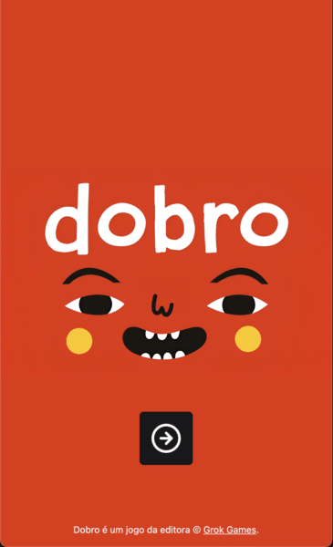

# Dobro Game Helper

This project is a Vue.js application designed to assist players in the game of Dobro. It provides a user-friendly interface for managing game states, players, and scores.



## Features

- **Player Management**: Add, remove, and manage players participating in the game.
- **Score Tracking**: Keep track of each player's score and red cards throughout the game.
- **Game State Management**: Easily navigate between different stages of the game, including welcoming new players, setting up new rounds, playing the game, and displaying the game over screen.

## Recommended IDE Setup

[VSCode](https://code.visualstudio.com/) + [Volar](https://marketplace.visualstudio.com/items?itemName=Vue.volar) (and disable Vetur).

## Type Support for `.vue` Imports in TS

TypeScript cannot handle type information for `.vue` imports by default, so we replace the `tsc` CLI with `vue-tsc` for type checking. In editors, we need [Volar](https://marketplace.visualstudio.com/items?itemName=Vue.volar) to make the TypeScript language service aware of `.vue` types.

## Customize configuration

See [Vite Configuration Reference](https://vitejs.dev/config/).

## Project Setup

```sh
pnpm install
```

### Compiles and hot-reloads for development

```sh
pnpm dev
```

### Compiles and minifies for production

```sh
pnpm build
```

### Contributing

Contributions are welcome! Please feel free to submit a pull request.
